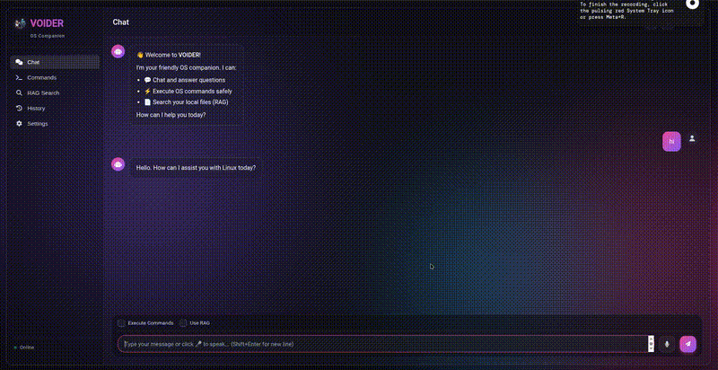
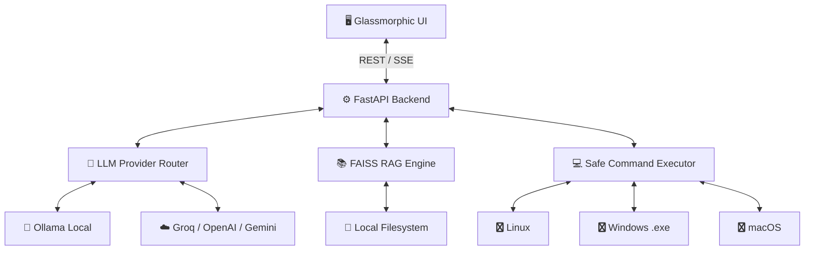

<div align="center">
  

  # 🌌 VOIDER
  
  **Your Intelligent, Privacy-Focused, Universal OS Companion**

  [](https://www.python.org/downloads/)
  [](https://fastapi.tiangolo.com/)
  [](https://ollama.com/)
  [](https://opensource.org/licenses/MIT)
  
  > *Chat, execute local system commands seamlessly across OS environments, and perform RAG-based file searches directly from a stunning glassmorphic interface—100% locally.*

</div>

<br/>

<div align="center">
  
</div>

---

## ✨ Features

VOIDER replaces clunky terminal operations with a sleek, unified graphical interface running natively on your system.

* 🔒 **100% Privacy Focused:** Powered locally by Ollama and FAISS. No cloud APIs, utter privacy.
* 🖥️ **Cross-Platform Compatibility:** Generates and executes commands tailored to your specific Linux, Windows, or macOS environment.
* 🛡️ **Safe Command Execution:** Multi-layered blocklist prevents destructive commands (e.g., `rm -rf /`).
* 🧠 **RAG-Powered File Search:** Ask questions about your local documents and get highly accurate, contextualized answers.
* 🎨 **Stunning Glassmorphic UI:** macOS-inspired translucent "unibody" window with dynamic futuristic aesthetics.
* 🔌 **Multi-Provider Support:** Seamlessly switch between local models (Ollama) and cloud APIs (Groq, OpenAI, Gemini, xAI).

---

## 🚀 Quick Install (1-Click)

Get VOIDER up and running in seconds. 

### Prerequisites
- Python 3.10+
- [Ollama](https://ollama.com/) (running locally)

### Linux/macOS
```bash
curl -sSL https://raw.githubusercontent.com/yourusername/voider/main/install.sh | bash
./start.sh
```
*(If you have cloned the repo, simply run `./install.sh` followed by `./start.sh`)*

### Windows (.exe)
Download the latest `voider-setup.exe` from the [Releases](https://github.com/yourusername/voider/releases) page and run the installer.
Alternatively, via PowerShell:
```powershell
Invoke-WebRequest -Uri "https://github.com/yourusername/voider/releases/latest/download/voider-setup.exe" -OutFile "voider-setup.exe"
start voider-setup.exe
```

### RPM Package (Fedora/RedHat)
```bash
sudo rpm -i voider-ai-os-1.0-1.fc43.x86_64.rpm
# Then start the app
./start.sh
```

---

## 🏗️ Architecture overview

VOIDER operates via a decoupled architecture, joining a high-performance Python application on the backend with a lightweight, highly-polished frontend.



---

## 🥊 How It Compares

| Feature | VOIDER 🌌 | Open Interpreter | Copilot CLI | Native Terminal |
|---------|-----------|------------------|-------------|-----------------|
| **UI** | Stunning Glassmorphic Web App | Terminal | Terminal | Terminal |
| **Privacy** | 100% Local (Ollama) | API Key needed (default) | Cloud | N/A |
| **Safety Blocklist** | Yes, Built-in | Prompts User | Prompts User | None |
| **RAG File Search** | Auto-indexed Local Docs | Basic Python Read | No | Grep/Find |
| **Cost** | Free (Open Source) | Varies (API) | Subscription | Free |

---

## 🛠️ Contributing & Good First Issues

**VOIDER** is built for the open-source community, and we want **YOU**!

Looking to get involved? Check out our issues labeled **`good first issue`**—perfect for newcomers:
* 🐛 **Bug:** Fix UI overflow on ultra-wide monitors.
* 📝 **Docs:** Add Docker setup instructions.
* ✨ **Feature:** Add a new theme to the UI settings.

### How to Contribute
1. **Fork the repo** and throw us a Star ⭐!
2. Create your feature branch: `git checkout -b feature/amazing-feature`
3. Commit your changes: `git commit -m 'Add amazing feature'`
4. Push to the branch: `git push origin feature/amazing-feature`
5. Open a Pull Request!

---

<div align="center">
  <h3>⭐⭐ If you find VOIDER useful, please consider giving it a star on GitHub! It helps a lot! ⭐⭐</h3>
  
  <p>Reach out to me at <a href="mailto:ashisdvpandey@gmail.com">ashisdvpandey@gmail.com</a></p>

  <p>Made with ❤️ by the VOIDER Open Source Community</p>
</div>
